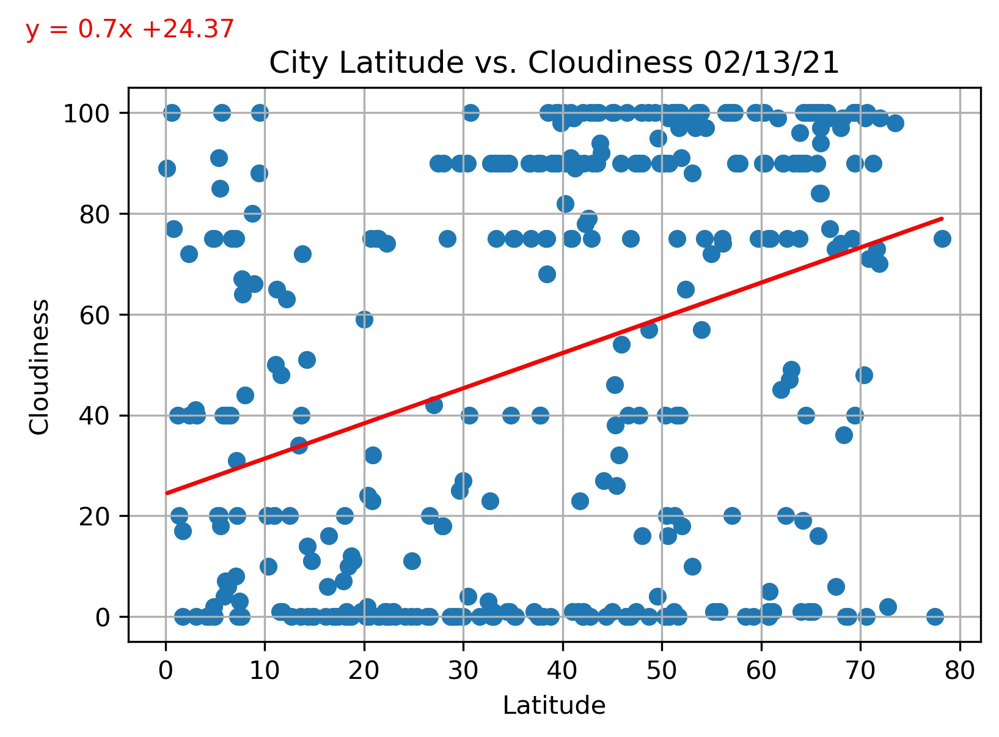

# Python API - What's the Weather Like?
## Background
In this exercise, we are going to answer a fundamental question: "What's the weather like as we approach the equator?" based on data.

## Part I - WeatherPy
In this example, we analyze the weather of 500+ cities across the world using the OpenWeatherMap API to see varying distance from the equator and we found the following conclusion:

### Based on the Scatter Data

#### Temperature (F) vs. Latitude
- The cities near to the Ecuator (Latitude 0) have warm temperature between 60 to over 80 (F).
- For this time of the year (February) we see that the southern hemisphere also has a warm temperature as it is summer season.

 .png)

 #### Latitude vs. Humidity
- As of February, this plot suggest that there is more humidity in the cities at the north hemisphere between latitude 60-80.

#### Latitude vs. Cloudiness
- As of February, there is no clear relation between latitude and clouds.

#### Latitude vs. Wind Speed
- As of February, this plot suggest that strongest winds happen in the cities at the north hemisphere between latitude 40-80.

### Based on the Linear Regression per Hemisphere

#### Latitude vs. Temperature (F)
- The regression line in the norther hemisphere predict low temperature as we go north in the hemisphere due to the winter season.
-On the contrary, the southern hemisphere predict high temperature having a minimum of 60°F due to the summer season.

 
 

 #### Latitude vs. Humidity
- The regression line in both hemisphere predict a high humidity value as we go north in the hemisphere.

#### Latitude vs. Cloudiness
- The regression line shown in both hemispheres shows a tendency to predict a high cloudiness value as we go north.

#### Latitude vs. Wind Speed
- As of February, the cities at the northern hemisphere have strongest winds reaching a maximum wind speed over 40 (mph)
- Most of the cities in the southern hemisphere have wind speed around 10 (mph) and the regression line predict a wind speed below 10 (mph)

## Part II - VacationPy

We are using data from the Part I to narrow down a search for the cities that the current weather report:

- A max temperature lower than 80 degrees but higher than 77.
- Wind speed less than 10 mph.
- Zero cloudiness.

The search report a list of 8 cities with the best weather conditons. We then search for the hotels in those cities within  5 km to plot them in a map with the heather layer on the back:

